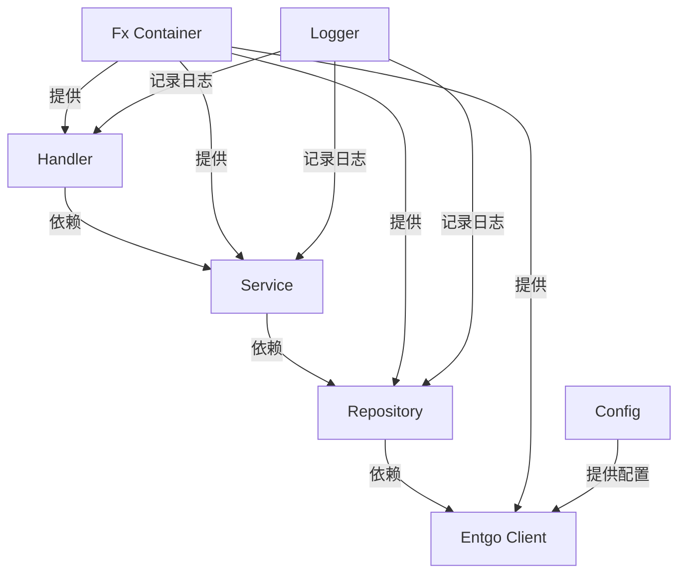

# 项目结构设计计划

## 1. 目录结构设计

基于 Go 最佳实践和当前项目的情况，我建议以下目录结构：

- **cmd/**：包含应用程序的入口点代码。
  - **cmd/nebula-live/**：主应用程序目录。
    - **main.go**：应用程序入口，使用 Fx 进行依赖注入。
- **internal/**：包含应用程序的核心逻辑，不希望被外部引用。
  - **internal/api/**：HTTP 处理程序和路由定义。
    - **handler/**：具体的处理程序函数。
      - **user.go**：用户相关的处理程序。
    - **middleware/**：中间件函数。
      - **common.go**：通用中间件。
      - **notfound.go**：未找到页面中间件。
    - **router.go**：路由定义，使用 Fiber。
    - **router/**：路由相关文件。
      - **registry.go**：路由注册。
      - **router.go**：路由定义。
      - **user.go**：用户相关路由。
  - **internal/app/**：应用程序相关代码。
    - **app.go**：应用程序逻辑。
    - **fiber.go**：Fiber 相关配置。
  - **internal/config/**：配置相关代码。
    - **cobra.go**：Cobra 命令行配置。
    - **config.go**：配置结构体和加载逻辑。
    - **types.go**：配置类型定义。
  - **internal/di/**：依赖注入相关代码。
    - **handler.go**：处理程序依赖注入。
    - **infrastructure.go**：基础设施依赖注入。
    - **repository.go**：存储库依赖注入。
    - **router.go**：路由依赖注入。
    - **service.go**：服务依赖注入。
  - **internal/entity/**：数据模型定义，使用 Entgo。
    - **ent/**：Entgo 生成的代码。
      - **client.go**：Entgo 客户端。
      - **ent.go**：Entgo 入口文件。
      - **generate.go**：Entgo 代码生成。
      - **mutation.go**：Entgo 变更操作。
      - **runtime.go**：Entgo 运行时。
      - **tx.go**：Entgo 事务操作。
      - **user_create.go**：用户创建操作。
      - **user_delete.go**：用户删除操作。
      - **user_query.go**：用户查询操作。
      - **user_update.go**：用户更新操作。
      - **user.go**：用户模型。
      - **enttest/**：Entgo 测试相关。
        - **enttest.go**：Entgo 测试文件。
      - **hook/**：Entgo 钩子。
        - **hook.go**：钩子定义。
      - **migrate/**：Entgo 数据库迁移。
        - **migrate.go**：迁移逻辑。
        - **schema.go**：迁移模式。
      - **predicate/**：Entgo 谓词。
        - **predicate.go**：谓词定义。
      - **runtime/**：Entgo 运行时。
        - **runtime.go**：运行时逻辑。
      - **schema/**：Entgo 模型定义。
        - **user.go**：用户模型定义。
      - **user/**：用户相关。
        - **user.go**：用户定义。
        - **where.go**：用户查询条件。
  - **internal/repository/**：数据访问层代码。
    - **repository.go**：数据库操作接口和实现，使用 Entgo。
    - **user.go**：用户相关存储库实现。
  - **internal/service/**：业务逻辑代码。
    - **service.go**：业务逻辑实现，依赖于 repository。
    - **user.go**：用户相关服务逻辑。
- **pkg/**：包含可以被外部项目引用的共享代码。
  - **pkg/logger/**：日志记录包（已存在）。
- **go.mod** 和 **go.sum**：Go 模块文件（已存在）。
- **.air.toml**：Air 工具配置文件。
- **.gitignore**：Git 忽略文件。
- **.roomodes**：Roo 模式配置文件。
- **config.yml**：项目配置文件。
- **Makefile**：构建脚本。

## 2. 依赖注入集成（Fx）

- **Fx 初始化**：在 `cmd/nebula-live/main.go` 中使用 Fx 初始化依赖注入容器。
- **模块定义**：为每个主要组件定义 Fx 模块，例如 `logger`、`config`、`repository`、`service`、`handler` 等。
- **依赖关系**：通过 Fx 提供依赖关系，例如 `service` 依赖于 `repository`，`handler` 依赖于 `service`。
- **生命周期管理**：使用 Fx 的生命周期钩子管理资源的初始化和清理，例如数据库连接。

## 3. 数据库 ORM 集成（Entgo）

- **模型定义**：在 `internal/entity/ent/schema/` 目录下定义 Entgo 模型。
- **代码生成**：使用 Entgo 的代码生成工具生成模型和数据库操作代码，输出到 `internal/entity/ent/`。
- **数据库操作**：在 `internal/repository/` 目录下实现数据库操作，封装 Entgo 生成的代码，提供更高级别的接口。
- **依赖注入**：通过 Fx 将数据库客户端注入到 `repository` 实现中。

## 4. 模块化设计原则

- **关注点分离**：将代码按功能分离到不同的目录和包中，例如 `handler`、`service`、`repository`。
- **接口驱动**：在 `service` 和 `repository` 之间定义接口，确保低耦合。
- **内部封装**：将核心逻辑放在 `internal/` 目录下，防止外部直接依赖。

## 5. Mermaid 流程图

以下是一个简单的 Mermaid 流程图，展示了主要组件之间的依赖关系：

## 6. 实施步骤

1. 创建目录结构：按照上述设计创建所有必要的目录。
2. 移动现有代码：将 `main.go` 移动到 `cmd/nebula-live/`，并更新其中的代码以使用 Fx。
3. 添加 Fx 依赖：更新 `go.mod` 文件，添加 Fx 依赖。
4. 定义 Fx 模块：在 `cmd/nebula-live/main.go` 中定义 Fx 模块和依赖关系。
5. 添加 Entgo 依赖：更新 `go.mod` 文件，添加 Entgo 依赖。
6. 定义 Entgo 模型：在 `internal/entity/ent/schema/` 中定义模型，并生成代码。
7. 实现 repository 和 service：在 `internal/repository/` 和 `internal/service/` 中实现相应的逻辑。
8. 更新 handler：在 `internal/api/handler/` 中实现 HTTP 处理程序，使用 `service`。
9. 配置路由：在 `internal/api/router.go` 中定义路由。
10. 测试结构：确保所有组件正确连接并能正常工作。